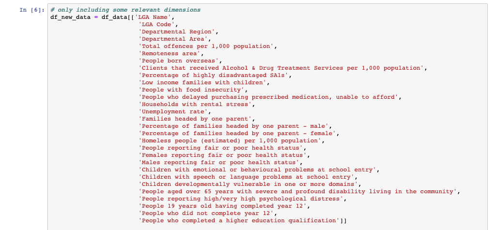
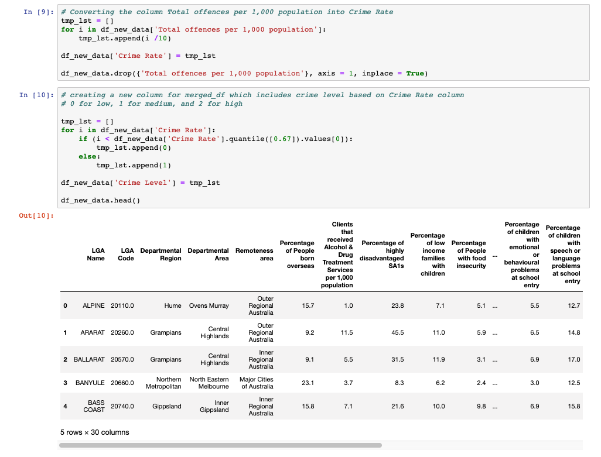
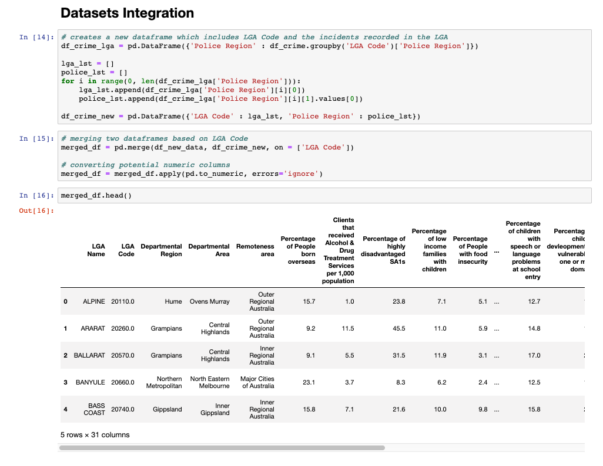
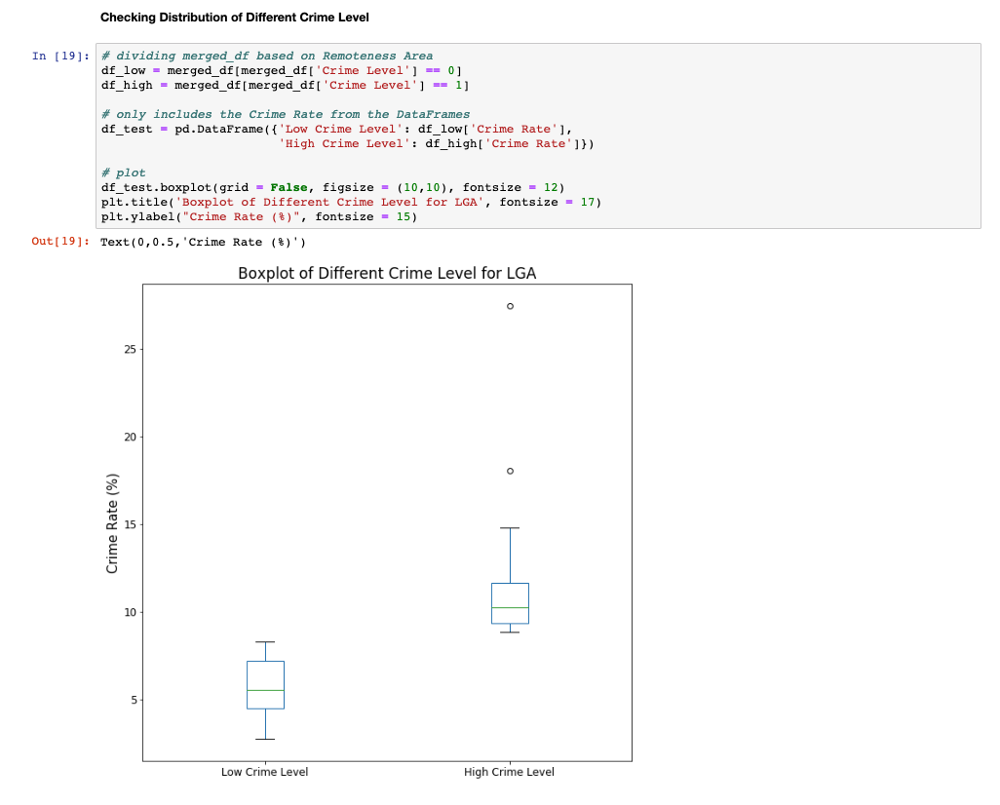
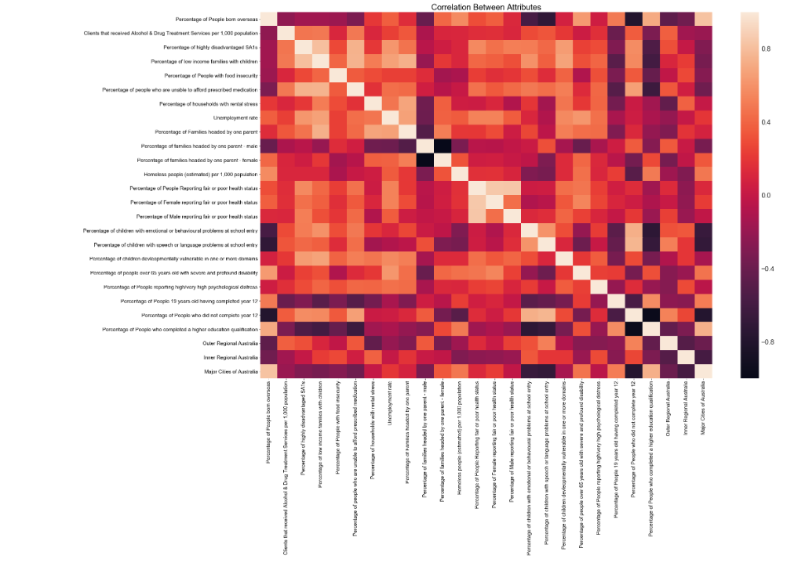
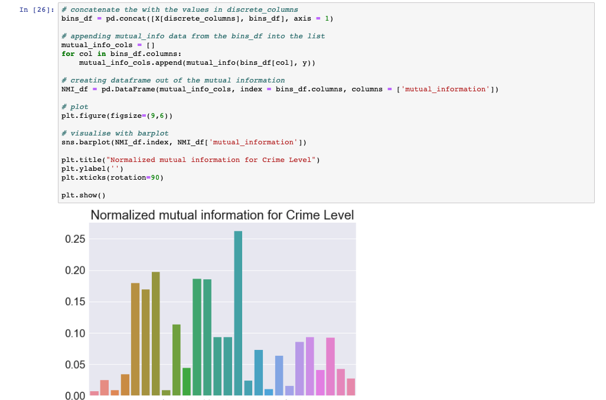

# Factors-of-High-Crime-Rate-in-Victoria-Data-Processing-and-Analysis-

### how to run
1. clone or download the repository
2. cd (change directory) to the downloaded repository
3. run jupyter notebook (install jupyter notebook if you haven't, brew install jupyter)
4. wait until browser is opened, then click on the file 'Data Processing and Analysis Code.ipynb'

### data process and analysis

